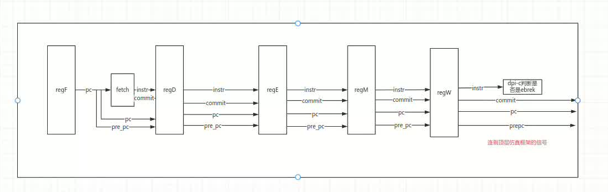

# {{ $frontmatter.title }}

## 克隆项目

```shell
$ git clone git@github.com:cs-prj-repo/cpu-pipeline.git
```


该项目只支持总控式五级流水线，不支持握手信号的五级流水线。

## 五级流水线需要的仿真信号

由于使用Difftest机制是让`参考处理器`和`你的处理器`对比同一条指令执行完后的寄存器状态和`pc`信息.
<br>对于单周期处理器来说，可以很简单的做到，因为单周期处理器每个周期就执行一条指令。
<br>对于五级流水线处理器而言，一个时钟周期最多会有五条指令在执行，我们很难判断当前执行的指令是哪一个，哪一条指令执行完毕了。

为了确保我们可以捕捉到流水线处理器中真正执行完毕的那条指令，我们要对框架的仿真信号做出一定的修改。

<br>项目使用的策略如下，当一个指令到达了写回阶段的时，Difftest就会认为这条指令执行完毕了， 接着就会对比`你的处理器`和`参考处理器`的寄存器状态。
在具体实现上，我们使用一个1bit的commit信号，在取指阶段取出来指令后同时将这个commit设置为1，而后随着流水线一起流动，当commit到达写回阶段时，我们就判断出有一条指令执行完毕了。
(气泡Bubble的commit永远设置为0)

虽然我们可以通过commit信号知道有一条指令执行完毕，但是仿真环境无法知道具体是哪条指令，所以我们也要让具体执行的`指令pc`和指令`instr`随着流水线一起流动到达写回阶段，并传递给仿真框架，让仿真框架知道执行了哪条指令。


由于Difftest检测的是一条指令执行后的`寄存器信息`和`PC`, 一条指令执行后，pc会变为`pc+4`或`pc的跳转地址`，所以我们也要让这条指令执行完毕后的pc值即`pre_pc`随着流水线一起流动到达写回阶段。

::: warning 注意-向仿真环境传递的信号

`pre_pc`信号:
<br>向仿真信号传递的`pre_pc`值需要是正确的`pre_pc`值。
<br>如果一条分支指令会跳转，那么`pre_pc`需要是跳转后的地址.

`pc`信号:
<br> 是在流水线里面流到写回阶段的那条指令的pc值,不是当前PC寄存器的pc值

`commit`信号:
<br>可以IP/pipeline-cpu/fetch.v

`instr`信号
<br>是在流水线里面流到写回阶段的那条指令

:::
具体信号可以参考下图

## DPI-C如何接入

见`fetch.v`、`memory.v`、`regfile.b`、`memory.v`、`write_back.b`


## 流水线的气泡指令

流水线的气泡指令建议为`addi x0, x0, 0`，其十六进制为`0x00000013`,其二进制为`00000000000000000000000000010011`。

## Difftest检测和波形信息说明

在单周期处理中，由于处理器在一个周期只执行一条指令，所以错误指令被Difftest捕捉时，一般为波形文件的最后一条指令。

不过在流水线处理器中，当错误指令进行到写回阶段并被Difftest捕捉到时，仿真框架早已追踪了取指，译码，执行，访存指令的波形信息。

由于我们是在Difftest捕捉到错误并结束波形追踪时，此时仿真框架早已追踪了几条经历过译码、执行、访存指令。
<br>因此和单周期不同，Difftest捕捉的出错的指令通常不是波形文件的最后一条波形，而是最后一条波形前面4-5个`clk`的波形。
<br>由于流水线中有Stall和Bubble的存在，则会使得波形文件更加复杂, 一般真正出错的指令为波形文件最后一条波形前面4-20个`clk`的波形。

以上是错误指令在波形文件的大概位置，具体是哪一条波形，我们还需要通过`pc`和`instr`进行准确定位。

对于Difftest捕捉Store指令和Load指令出错的机制，和单周期处理器类似。


## 其他内容和单周期一模一样